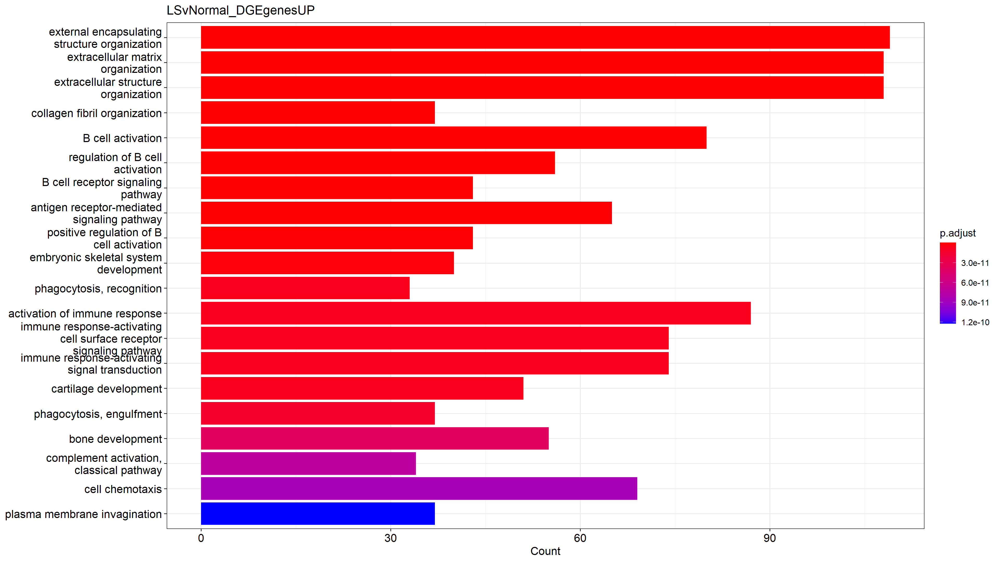
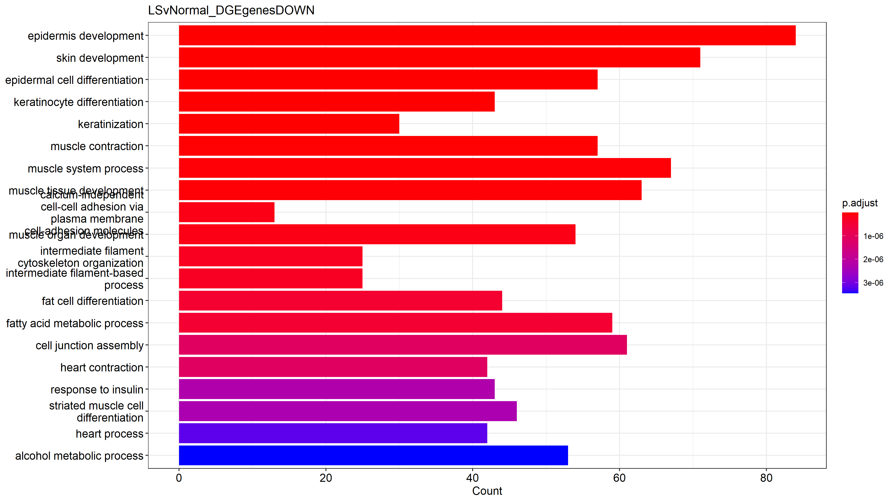

```{r setup, include=FALSE}
knitr::opts_chunk$set(echo = TRUE)
```

## Introduction

Keloids are scars that result from abnormal fibrous wound healing wherein repair and regulating mechanism control is lost as the scars grow over time and extend beyond the initial site of injury and can cause significant emotional and physical distress in patients. Although the mechanism is unknown, keloid formation is associated with a variety of genetic and epigenetic factors. A strong genetic predisposition is suggested by the fact that keloids are more common in dark skinned individuals, and in twins and families with history of keloid formation.[1][2] Pathogenesis of keloids remain unclear with no reliable or consistent treatment options. Unlike Hypertrophic scars which usually subside with time, keloids can continue to evolve over time.[3]

Here the transcriptomic profile of lesional and non-lesional keloid skin is compared to normal skin using bulk RNA-seq data. The hypothesis is that there should be significant differences in gene expression seen from the transcriptomic profile. It is expected to see genes related to the immune system and collagen/skin generation being differentially expressed.

## Results

There are several differentially expressed genes across the three conditions: Keloid Lesion (LS), normal skin from patient with Keloids (NL), normal skin from patients with no history of keloids (Normal).


Figure 1: PCA plot of normalized (rlog) counts data.


Figure 2: Sample Distance Heatmap

These plots somewhat make sense when comparing across the three condition. However, when just looking at the LS group which are clustered together in both Figure 1 and Figure 2, the results are much more coherent since we would expect to see the biggest difference with the LS group compared to the other two conditions. The LS condition is the group of samples taken from a lesion with keloid, whereas the Normal is healthy non-lesional skin, and NL is also non leasional skin but from patients with keloids on other sites. The latter two groups have the same phenotype so it is not unexpected to see that they do not differ greatly in terms of the transcriptome. When compared with the results from the paper wherefrom the RNAseq data was taken , the Normal and NL group are very similar. The PCA indicates that one of the samples in the control is an outlier (Normal_N20).


Figure 3a : Heatmap of Differentially Expressed Genes from LS vs Normal comparison,


Figure 3b: Heatmap of Differentially Expressed Genes from NL vs Normal comparison,

The LS vs Normal shows a clear difference in gene expression with the LS samples clustering separately (Figure 3a). However, the NL and Normal conditions do not separate well. As expected, the NL vs Normal heatmap does not indicate strong expression patterns but surprisingly clustered the samples in three conditions well (Figure 3b).


Figure 4: Plots showing log2 normalized gene expression across the three conditions

From figure 4, we can see genes for collagen and skin proliferation being highly expressed in the keloid condition. LOXL2 is essential to the biogenesis of connective tissue and collagen formation, and is a promising target for ameliorating scarring as reported by Chaudari et al.[4] Figure 3a shows that BMP1 is differentially expressed and is highly expressed in the keloid tissue. BMP1 gene is responsible for inducing the formation of cartilage.





Figure 5: Gene Ontology for Lesional vs Non-Lesional Upregulated and Downregulated DE genes.

Gene Ontology (GO) of NL versus Normal upregulated genes revealed zero pathways. GO of NL versus Normal down-regulated genes did not offer insight into pathways, and the gene counts for the pathways presented are very low. GO of the remaining comparisons yield useful insight. The expression for Lesional vs Non-Lesional and Lesional vs Normal is very similar. The gene ontology analysis revealed very similar pathways that are upregulated in the keloid condition. As hypothesized, the genes related to the immune system and collagen/skin generation are differentially expressed and upregulated in the keloid samples (Figure 5). In addition, genes related to bone/cartilage formation are also upregulated which is in agreement with the results presented by Wu et al [5]. Figure 5 also shows that genes related to epidermis and skin development, and epidermal differentiation are downregulated.

Future experiments would include qRT-PCR to validate and expand RNA-Seq Data which would be especially insightful when studying the immune response. Additionaly, targeting some of the genes such as LOXL2 or BMP1 that are over expressed in the keloid condition and assessing the phenotype in addition to the transciptome profile after inhibition, would lead to promising therapeutic strategies. The limitations of the dataset are the small sample size, and lack of another experimental condition. Increasing the sample size would allow more confidence in obtaining differences across the three conditions, especially Non lesional and normal. One control sample seems to vary from the other samples as shown in the PCA plot (Figure 1) which would affect the results. The other experimental condition that should be included is Non keloid scar so that we can differentiate between genes expressed in the normal healing/scar pathways and keloid scars. Also, the time between wound formation and keloid formation or preferably, biopsy, should be included in the dataset.

### Methods

The dataset of interest used single read TruSeq Stranded mRNA Library Prep kit, and the mRNA was obtained via miRNAeasy Mini Kit and poly-A selection. They used Illumina NovaSeq 6000 platform. 100 cycles, single-read sequencing, and read length of 100.

Samples were from 4 keloid lesions obtained from 3 different patients and 6 healthy controls. There are two main experimental conditions: Normal and Keloid. The keloid group has two sub groups where sample from the keloid lesion and non lesional sample, were taken. Study was invivo human skin, and samples were obtained via skin biopsy.

Associated with study:

Wu J, Del Duca E, Espino M, Gontzes A et al. RNA Sequencing Keloid Transcriptome Associates Keloids With Th2, Th1, Th17/Th22, and JAK3-Skewing. Front Immunol 2020;11:597741. PMID: 33329590

Study was done by dept. of dermatology in Mt Sinai

#### Downloading Data

13 Fastq files were downloaded from SRA: SRP285028, GEO: GSE158395.

Using Fastqc and multiqc, the quality of the reads are very uniform and high with phred scores around 36, however, they failed sequence duplication levels.

    for file in /athena/angsd/scratch/avk4003/samples/*fastq.gz; do
        fastqc --extract -o /athena/angsd/scratch/avk4003/fastqc_reports "$file"
    done
    for file in /athena/angsd/scratch/avk4003/fastqc_reports/*_fastqc.zip; do
        mv "$file" /athena/angsd/scratch/avk4003/multi_report
    multiqc multi_report/


#### STAR Align

Fastq files were then aligned using STAR. The reference genome used was Human genome GRCh38 .fa.gz (Homo_sapiens.GRCh38.dna.primary_assembly.fa.gz) and the annotation file used was Homo_sapiens.GRCh38.109.gtf. Both the reference genome and annotation were obtained from Ensembl

Generating index

    STAR --runMode genomeGenerate --runThreadN 1 --genomeDir /athena/angsd/scratch/avk4003/reference_genome/GRCh38_STARindex --genomeFastaFiles /athena/angsd/scratch/avk4003/reference_genome/Homo_sapiens.GRCh38.dna.primary_assembly.fa --sjdbGTFfile /athena/angsd/scratch/avk4003/reference_genome/Homo_sapiens.GRCh38.109.gtf

Star aligning

No extra parameters had to be specified since data was single read, and intron lengths in humans can vary widely and can be extremely long (see supplementary code). However, \--sjdbOverhang could have been set to 99, but default of 100 was used here. In most cases, the default value of 100 will work as well as the ideal value

    STAR --runMode alignReads \
        --runThreadN 1 \
        --genomeDir /athena/angsd/scratch/avk4003/reference_genome/GRCh38_STARindex \
        --readFilesIn "$file" \
        --readFilesCommand zcat \
        --outFileNamePrefix /athena/angsd/scratch/avk4003/mapped/${out_name}. \
        --outSAMtype BAM SortedByCoordinate ;
    done

STAR alignment was used since it has a higher tolerance for more soft-clipped and mismatched bases compared to HISAT2, which leads to a higher mapping rate

#### Alignment QC

For Alignment QC, QORTs followed by multiqc was used. --singleEnded and --stranded parameters were added as the data is single end reads and reverse stranded.

    mamba activate qorts
    for file in mapped/*.bam; do
    out_name="${file%.Aligned.sortedByCoord.out.bam}"
    out_name="${out_name##*/}"
    java -Xmx8G -jar ~luce/angsd/gierlinski/alignment_qc/QoRTs.jar QC --singleEnded --stranded --generatePdfReport ${file} /athena/angsd/scratch/avk4003/reference_genome/Homo_sapiens.GRCh38.109.gtf qorts_1/${out_name}

    mamba activate multiqc
    cd qorts_1
    multiqc


    done

Majority of genes mapped to Unique Gene as shown in multiqc_alignment_report.html. Qorts file also does not show signficant 3' or 5' degradation. Alignment QC looks good since primary alignments is greater than 90% and genome is sufficiently covered.

#### Count Table

Using feature counts, the count table was generated. Feature counts was first run with -s1 flag. Looking at the multiQC to see single digit percentages of successful mappings, the flag was changed to -s2 which rectified the issue. Multiqc was then performed again.

    mamba activate angsd
    featureCounts -s 2 -a /athena/angsd/scratch/avk4003/reference_genome/Homo_sapiens.GRCh38.109.gtf -o counts/readcounts_s2.txt /athena/angsd/scratch/avk4003/mapped/*.bam
    cd counts/
    mamba activate multiqc
    multiqc .

#### DE analysis in R

[Reading counts matrix]{.underline}

```{r, eval=FALSE}
library(ggplot2)
library(DESeq2)

readcounts <- read.table("readcounts_s2.txt", header = TRUE)
```

[Clean and rename columns]{.underline}

```{r, eval =FALSE}
# rename column names
orig_names <- names(readcounts)
names(readcounts)
colnames(readcounts) <- gsub(".*mapped\\.|\\.Aligned.*", "", colnames(readcounts))
names(readcounts)
# rename rownames
row.names(readcounts) <- make.names(readcounts$Geneid)
readcounts <- readcounts[ , -c(1:6)]
head(readcounts)
#counts data preprocessing complete
```

[Create sample_info matrix]{.underline}

```{r, eval=FALSE}
#colData processing
sample_info <- data.frame(condition = gsub("_.+", "", names(readcounts)),
row.names = names(readcounts) )
sample_info
#perform check 
all(colnames(readcounts)==rownames(sample_info)) # safety check
```

[Create DEseq Object]{.underline}

```{r, eval =FALSE}
DESeq.ds <- DESeqDataSetFromMatrix(countData = as.matrix(readcounts), colData = sample_info, design = ~ condition)
head(DESeq.ds)
colSums(counts(DESeq.ds)) %>% barplot
#remove low reads
dim(DESeq.ds)
keep_genes <- rowSums(counts(DESeq.ds)) > 10 #filter 
DESeq.ds <- DESeq.ds[ keep_genes, ]
dim(DESeq.ds)

#set base condition to Normal
DESeq.ds$condition
DESeq.ds$condition %<>% relevel(ref="Normal")
# DESeq.ds$condition <- relevel(DESeq.ds$condition, ref="Normal")
DESeq.ds$condition
```

To reduce noise, clean up data, and reduce computation, very low reads were filtered out. The threshold chosen was the sum of all the reads per gene must be greater than 10.

[run DEseq]{.underline}

```{r, eval=FALSE}
#Perform DESeq
DESeq.ds %<>% DESeq()
rowData(DESeq.ds) %>% colnames
```

[Quality control]{.underline}

```{r, eval=FALSE}
boxplot(log2(counts(DESeq.ds) +1), notch=TRUE,
main = "Non-normalized read counts",
ylab ="log2(read counts)", cex = .6)

## bp of size-factor normalized values
boxplot(log2(counts(DESeq.ds, normalized=TRUE) +1), notch=TRUE,
main = "Size-factor-normalized read counts",
ylab ="log2(read counts)", cex = .6)


png('Plots/dispPlot.png', res=200, width = 1900, height = 1100)
print(plotDispEsts(DESeq.ds))
dev.off()
plotDispEsts(DESeq.ds)

```

There are not significant global differences between samples, nonetheless, the normalization helped adjust slight global differences between the samples

Dispersion plot shows that fitted line trends below 1

[PCA and cluster heatmap]{.underline}

```{r, eval=FALSE}
#PCA
library(pcaExplorer)
DESeq.rlog <- rlog(DESeq.ds, blind = FALSE)
#pcaExplorer(dds = DESeq.ds, dst = DESeq.rlog)
plotPCA(DESeq.rlog, intgroup=c("condition"))

png('Plots/PCA.png', res=250, width = 1900, height = 1100)
print(plotPCA(DESeq.rlog, intgroup=c("condition")))
dev.off()

sampleDists <- dist(t(assay(DESeq.rlog)))
sampleDistMatrix <- as.matrix(sampleDists)
rownames(sampleDistMatrix) <- paste(DESeq.rlog$condition)
colnames(sampleDistMatrix) <- NULL
colors <- colorRampPalette( rev(brewer.pal(9, "Blues")) )(255)
sampleDistHeat<-pheatmap(sampleDistMatrix,
         clustering_distance_rows=sampleDists,
         clustering_distance_cols=sampleDists,
         col=colors)
png('Plots/sampleDistHeat.png', res=250, width = 1900, height = 1100)
print(sampleDistHeat)
dev.off()
```

These plots somewhat make sense when comparing across the three condition. However, when just looking at the LS group, the results are much more coherent since we would expect to see the biggest difference with the LS group compared to the other two conditions. The LS condition is the group of samples taken from a lesion with keloid, whereas the Normal is healthy non-lesional skin, and NL is also non leasional skin but from patients with keloids on other sites. The latter two groups have the same phenotype so it is not unexpected to see that they do not differ greatly in terms of the transcriptome. When compared with the results from the paper, the Normal and NL group are very similar. The PCA indicates that one of the samples in the control is an outlier (Normal_N20).

[Finding DE genes]{.underline}

Performing DE for each of the three comparisions: Lesional vs healthy control, Non-lesional vs healthy control, Lesional vs Non lesional. Alpha set to 0.05. Since there are three conditions we are comparing, the contrast= paramter was used.

```{r, eval=FALSE}
DGE_results_LSvNormal <- results(DESeq.ds, independentFiltering = TRUE, alpha = 0.05, contrast = c("condition","LS", "Normal"))
DGE_results_NLvNormal <- results(DESeq.ds, independentFiltering = TRUE, alpha = 0.05, contrast = c("condition","NL", "Normal"))
DGE_results_LSvNL <- results(DESeq.ds, independentFiltering = TRUE, alpha = 0.05, contrast = c("condition","LS", "NL"))

LSvNormal_MAplot<-plotMA(DGE_results_LSvNormal, alpha=0.05,
main="LS vs Normal Test: p.adj.value < 0.05", ylim = c(-5,5))
png('Plots/LSvNormal_MAplot.png', res=250, width = 1900, height = 1100)
print(plotMA(DGE_results_LSvNormal, alpha=0.05,
main="LS vs Normal Test: p.adj.value < 0.05", ylim = c(-5,5)))
dev.off()

NLvNormal_MAplot<-plotMA(DGE_results_NLvNormal, alpha=0.05,
main="NL vs Normal Test: p.adj.value < 0.05", ylim = c(-5,5))
png('Plots/NLvNormal_MAplot.png', res=250, width = 1900, height = 1100)
print(plotMA(DGE_results_NLvNormal, alpha=0.05,
main="NL vs Normal Test: p.adj.value < 0.05", ylim = c(-5,5)))
dev.off()


LSvNL_MAplot<-plotMA(DGE_results_LSvNL, alpha=0.05,
main="LS vs NL Test: p.adj.value < 0.05", ylim = c(-5,5))
png('Plots/LSvNL_MAplot.png', res=250, width = 1900, height = 1100)
print(plotMA(DGE_results_LSvNL, alpha=0.05,
main="LS vs NL Test: p.adj.value < 0.05", ylim = c(-5,5)))
dev.off()

LSvNormal_MAplot
NLvNormal_MAplot
LSvNL_MAplot

```

MA plots confirm presence of DE genes. Much more DE genes in LS vs Normal and LS vs NL. NL vs Normal has very few DE genes in comparison, and is in agreement with the results of PCA.

[Removing NA values]{.underline}

NA values are removed to clean data. The dimensions of the matrices are displayed to show how many rows were removed due to cleaning. The matrices were then sorted in ascending order of adjusted p value (\$padj).

```{r, eval=FALSE}
dim(DGE_results_NLvNormal)
DGE_results_NLvNormal<-na.omit(DGE_results_NLvNormal)
dim(DGE_results_NLvNormal)

dim(DGE_results_LSvNormal)
DGE_results_LSvNormal<-na.omit(DGE_results_LSvNormal)
dim(DGE_results_LSvNormal)

dim(DGE_results_LSvNL)
DGE_results_LSvNL<-na.omit(DGE_results_LSvNL)
dim(DGE_results_LSvNL)

DGE_results_NLvNormal_sorted <- DGE_results_NLvNormal %>% `[`(order(.$padj),)
DGE_results_LSvNormal_sorted <- DGE_results_LSvNormal %>% `[`(order(.$padj),)
DGE_results_LSvNL_sorted <- DGE_results_LSvNL %>% `[`(order(.$padj),)
```

[Extract significant gene names]{.underline}

extract significant gene names (ENSEMBL IDs) by filtering for padj values less than 0.05, and a log2FoldChange greater than 1 or less than -1

Using criteria of fold-change (FCH)\>2 and false discovery rate (FDR)\<0.05 to define differentially expressed genes (DEGs). There were many DE genes so used more stringent requirements.

```{r, eval=FALSE}
NLvNormal_DGEgenes <- rownames(subset(DGE_results_NLvNormal_sorted, padj < 0.05 & abs(log2FoldChange) > 1))
LSvNormal_DGEgenes <- rownames(subset(DGE_results_LSvNormal_sorted, padj < 0.05 & abs(log2FoldChange) > 1))
LSvNL_DGEgenes <- rownames(subset(DGE_results_LSvNL_sorted, padj < 0.05 & abs(log2FoldChange) > 1))
```

[Heatmap of DE genes]{.underline}

Three heatmaps for the three comparisons, displaying the DE genes for each sample. The heatmap shows the top 50 DE genes.

Added gene symbols from org.Hs.eg.db database

```{r, eval=FALSE}
heatmap_rlog_df<-assay(DESeq.rlog[LSvNormal_DGEgenes,])
ensembl_ids <- rownames(heatmap_rlog_df)
gene_names <- mapIds(org.Hs.eg.db, keys = ensembl_ids, column = "SYMBOL", keytype = "ENSEMBL", multiVals = "first")
rownames(heatmap_rlog_df) <- gene_names
gene_names_LSvNormal <- rownames(heatmap_rlog_df[1:100, ])

LSvNormal_heat<-pheatmap(heatmap_rlog_df[1:50, ], scale="row",show_rownames=TRUE, main="LS vs Normal DGE (row-based z-score)")

png('Plots/LSvNormal_heat.png', res=250, width = 1500, height = 2100)
print(LSvNormal_heat)
dev.off()
LSvNormal_heat

heatmap_rlog_df<-assay(DESeq.rlog[LSvNL_DGEgenes,])
ensembl_ids <- rownames(heatmap_rlog_df)
gene_names <- mapIds(org.Hs.eg.db, keys = ensembl_ids, column = "SYMBOL", keytype = "ENSEMBL", multiVals = "first")
rownames(heatmap_rlog_df) <- gene_names
gene_names_LSvNL <- rownames(heatmap_rlog_df[1:100, ])

LSvNL_heat<-pheatmap(heatmap_rlog_df[1:50, ], scale="row",show_rownames=TRUE, main="LS vs NL DGE (row-based z-score)")
png('Plots/LSvNL_heat.png', res=250, width = 1500, height = 2100)
print(LSvNL_heat)
dev.off()
LSvNL_heat

heatmap_rlog_df<-assay(DESeq.rlog[NLvNormal_DGEgenes,])
#library(org.Hs.eg.db)
ensembl_ids <- rownames(heatmap_rlog_df)
gene_names <- mapIds(org.Hs.eg.db, keys = ensembl_ids, column = "SYMBOL", keytype = "ENSEMBL", multiVals = "first")
rownames(heatmap_rlog_df) <- gene_names
gene_names_NLvNormal <- rownames(heatmap_rlog_df[1:50, ])

NLvNormal_heat<-pheatmap(heatmap_rlog_df[1:50, ], scale="row",show_rownames=TRUE, main="NL vs Normal DGE (row-based z-score)")
png('Plots/NLvNormal_heat.png', res=250, width = 1500, height = 2100)
print(NLvNormal_heat)
dev.off()
NLvNormal_heat
```

[Volcano plots]{.underline}

Added gene symbols from org.Hs.eg.db database.

```{r, eval=FALSE}
# add column with Gene symbols
DGE_results_NLvNormal_sorted_symbol<-DGE_results_NLvNormal_sorted
DGE_results_LSvNormal_sorted_symbol<-DGE_results_LSvNormal_sorted
DGE_results_LSvNL_sorted_symbol<-DGE_results_LSvNL_sorted

DGE_results_NLvNormal_sorted_symbol$symbol<-mapIds(org.Hs.eg.db, keys = rownames(DGE_results_NLvNormal_sorted_symbol), keytype = "ENSEMBL", column = "SYMBOL")
DGE_results_LSvNormal_sorted_symbol$symbol<-mapIds(org.Hs.eg.db, keys = rownames(DGE_results_LSvNormal_sorted_symbol), keytype = "ENSEMBL", column = "SYMBOL")
DGE_results_LSvNL_sorted_symbol$symbol<-mapIds(org.Hs.eg.db, keys = rownames(DGE_results_LSvNL_sorted_symbol), keytype = "ENSEMBL", column = "SYMBOL")

# plot volcano plots
library(EnhancedVolcano)

NLvNormal_Plot<-EnhancedVolcano(DGE_results_NLvNormal_sorted_symbol,
lab=DGE_results_NLvNormal_sorted_symbol$symbol,
x='log2FoldChange', y='padj', selectLab = gene_names_NLvNormal,
pCutoff=0.05,
title="NL / Normal")
png('Plots/NLvNormal_Plot.png', res=100, width = 1900, height = 1100)
print(NLvNormal_Plot)
dev.off()
NLvNormal_Plot

LSvNormal_Plot<-EnhancedVolcano(DGE_results_LSvNormal_sorted_symbol,
lab=DGE_results_LSvNormal_sorted_symbol$symbol,
x='log2FoldChange', y='padj', selectLab = gene_names_LSvNormal ,
pCutoff=0.05,
title="LS / Normal")
png('Plots/LSvNormal_Plot.png', res=100, width = 1900, height = 1100)
print(LSvNormal_Plot)
dev.off()
LSvNormal_Plot

LSvNL_Plot<-EnhancedVolcano(DGE_results_LSvNL_sorted_symbol,
lab=DGE_results_LSvNL_sorted_symbol$symbol,
x='log2FoldChange', y='padj', selectLab = gene_names_LSvNL ,
pCutoff=0.05,
title="LS / NL")

png('Plots/LSvNL_Plot.png', res=100, width = 1900, height = 1100)
print(LSvNL_Plot)
dev.off()
LSvNL_Plot
```

[Normalized gene expression plots]{.underline}

Created plots using plotCounts to display a few interesting DE genes. the returnData parameter was set to TRUE in order to get the matrix so that the plot can be displayed in ggplot boxplot for asthetic purposes.

```{r, eval=FALSE}
df<-plotCounts(DESeq.ds, gene="ENSG00000115414", normalized = TRUE, transform = TRUE, xlab="Condition", returnData = TRUE)
p1<-ggplot(df, aes(x = condition, y = count, fill = condition)) +geom_boxplot()+theme_bw()+labs(x = "Condition", y = "Log2 Normalized Counts", title = "FN1")

df<-plotCounts(DESeq.ds, gene="ENSG00000105664", normalized = TRUE, transform = TRUE, xlab="Condition", returnData = TRUE)
p2<-ggplot(df, aes(x = condition, y = count, fill = condition)) +geom_boxplot()+theme_bw()+labs(x = "Condition", y = "Log2 Normalized Counts", title = "COMP")

df<-plotCounts(DESeq.ds, gene="ENSG00000134013", normalized = TRUE, transform = TRUE, xlab="Condition", returnData = TRUE)
p3<-ggplot(df, aes(x = condition, y = count, fill = condition)) +geom_boxplot()+theme_bw()+labs(x = "Condition", y = "Log2 Normalized Counts", title = "LOXL2")

df<-plotCounts(DESeq.ds, gene="ENSG00000157766", normalized = TRUE, transform = TRUE, xlab="Condition", returnData = TRUE)
p4<-ggplot(df, aes(x = condition, y = count, fill = condition)) +geom_boxplot()+theme_bw()+labs(x = "Condition", y = "Log2 Normalized Counts", title = "ACAN")


df<-plotCounts(DESeq.ds, gene="ENSG00000119699", normalized = TRUE, transform = TRUE, xlab="Condition", returnData = TRUE)
p6<-ggplot(df, aes(x = condition, y = count, fill = condition)) +geom_boxplot()+theme_bw()+labs(x = "Condition", y = "Log2 Normalized Counts", title = "TGFB3")

df<-plotCounts(DESeq.ds, gene="ENSG00000149257", normalized = TRUE, transform = TRUE, xlab="Condition", returnData = TRUE)
p7<-ggplot(df, aes(x = condition, y = count, fill = condition)) +geom_boxplot()+theme_bw()+labs(x = "Condition", y = "Log2 Normalized Counts", title = "SERPINH1")


library(cowplot)

pg<-plot_grid(p1, p2, p3, p4,p6,p7, ncol = 3)


png('Plots/PlotGrid.png', res=250, width = 1900, height = 1100)
print(pg)
dev.off()
pg
```

[GO analysis]{.underline}

clusterProfiler was used to perform GO analysis for all three comparisons, and for up regulated and downregulated DE genes. Followed tutorial from Sanbomics. The genes used to perform GO analyses were filtered in order to be DE (padj\<0.05) and to have a log2foldchange \>1 for upregulated GO analysis, and \<-1 for downregulated GO analysis.

```{r, eval=FALSE}
library(clusterProfiler)
library(AnnotationDbi)
NLvNormal_DGEgenesUP <- rownames(subset(DGE_results_NLvNormal_sorted, padj < 0.05 & log2FoldChange > 1))
LSvNormal_DGEgenesUP <- rownames(subset(DGE_results_LSvNormal_sorted, padj < 0.05 & log2FoldChange > 1))
LSvNL_DGEgenesUP <- rownames(subset(DGE_results_LSvNL_sorted, padj < 0.05 & log2FoldChange > 1))


NLvNormal_DGEgenesDOWN <- rownames(subset(DGE_results_NLvNormal_sorted, padj < 0.05 & log2FoldChange < -1))
LSvNormal_DGEgenesDOWN <- rownames(subset(DGE_results_LSvNormal_sorted, padj < 0.05 & log2FoldChange < -1))
LSvNL_DGEgenesDOWN <- rownames(subset(DGE_results_LSvNL_sorted, padj < 0.05 & log2FoldChange < -1))

GO_results_NLvNormal_DGEgenesUP<-enrichGO(gene = NLvNormal_DGEgenesUP, OrgDb = "org.Hs.eg.db", keyType = "ENSEMBL", ont = "BP")
GO_results_LSvNormal_DGEgenesUP<-enrichGO(gene = LSvNormal_DGEgenesUP, OrgDb = "org.Hs.eg.db", keyType = "ENSEMBL", ont = "BP")
GO_results_LSvNL_DGEgenesUP<-enrichGO(gene = LSvNL_DGEgenesUP, OrgDb = "org.Hs.eg.db", keyType = "ENSEMBL", ont = "BP")

GO_results_NLvNormal_DGEgenesDOWN<-enrichGO(gene = NLvNormal_DGEgenesDOWN, OrgDb = "org.Hs.eg.db", keyType = "ENSEMBL", ont = "BP")
GO_results_LSvNormal_DGEgenesDOWN<-enrichGO(gene = LSvNormal_DGEgenesDOWN, OrgDb = "org.Hs.eg.db", keyType = "ENSEMBL", ont = "BP")
GO_results_LSvNL_DGEgenesDOWN<-enrichGO(gene = LSvNL_DGEgenesDOWN, OrgDb = "org.Hs.eg.db", keyType = "ENSEMBL", ont = "BP")


```

[Plot and Save GO analysis]{.underline}

```{r, eval=FALSE}
#plot(barplot(GO_results_NLvNormal_DGEgenesUP, showCategory = 20))
UpLSvNormal<-plot(barplot(GO_results_LSvNormal_DGEgenesUP, showCategory = 20, title = "LSvNormal_DGEgenesUP"))
UpLSvNL<-plot(barplot(GO_results_LSvNL_DGEgenesUP, showCategory = 20, title = "LSvNL_DGEgenesUP"))

DownNLvNormal<-plot(barplot(GO_results_NLvNormal_DGEgenesDOWN, showCategory = 20, title = "NLvNormal_DGEgenesDOWN"))
DownLSvNormal<-plot(barplot(GO_results_LSvNormal_DGEgenesDOWN, showCategory = 20, title = "LSvNormal_DGEgenesDOWN"))
DownLSvNL<-plot(barplot(GO_results_LSvNL_DGEgenesDOWN, showCategory = 20, title = "LSvNL_DGEgenesDOWN"),)

png('Plots/UpLSvNL.png', res=150, width = 1900, height = 1100)
print(UpLSvNL)
dev.off()


png('Plots/UpLSvNormal.png', res=150, width = 1900, height = 1100)
print(UpLSvNormal)
dev.off()


png('Plots/DownNLvNormal.png', res=150, width = 1900, height = 1100)
print(DownNLvNormal)
dev.off()


png('Plots/DownLSvNormal.png', res=150, width = 1900, height = 1100)
print(DownLSvNormal)
dev.off()


png('Plots/DownLSvNL.png', res=150, width = 1900, height = 1100)
print(DownLSvNL)
dev.off()


```

Gene Ontology (GO) of NL versus Normal upregulated genes revealed zero pathways and caused an error during plotting which is why the plot for NL vs Normal is commented out since there was nothing to plot.\
GO shows upregulation of immune system, collagen fibril organisation, ossification, extracelular matrix organisation, and down regulation of epidermis and skin development, and epidermal differentiation in the keloid condition.

[Saving Datasets]{.underline}

```{r, eval=FALSE}
rlog_data<-assay(DESeq.rlog)
write.csv(readcounts, "data/counts.csv")
write.csv(rlog_data, "data/rlog_data.csv")
write.csv(DGE_results_NLvNormal_sorted, "data/NLvNormal.csv")
write.csv(DGE_results_LSvNL_sorted, "data/LSvNL.csv")
write.csv(DGE_results_LSvNormal_sorted, "data/LSvNormal.csv")
```

#### Discussion

The first issue was creating a bash script. Since a windows device was used, when the script was transferred to the linux server, the script would run into an error. The fix to this was writing the script in the linux server itself instead of transferring from windows since windows adds invisible nextline characters which will cause an error in linux.\
The second issue was very low mapped unique reads (\<10% for each sample) when looking at the multiqc report for featureCounts. The issue was resolved when the stranded parameter in featureCounts was changed from s1 to s2 to indicate reverse strandedness.\
Another small problem was the error produced by plotting GO results of upregulated NLvsNormal genes. Unsurprisingly, there were no results produced from the enrichGO() function since there are not many differences between NL and the Control group. The plot for that was commented out, leaving 5 out of 6 plots.

**Dataset Table**

| Data                         | Link                                                                                                                                              |
|------------------------------|---------------------------------------------------------------------------------------------------------------------------------------------------|
| Counts data                  | [angsd_project/counts.csv at main · avk4003/angsd_project (github.com)](https://github.com/avk4003/angsd_project/blob/main/data/counts.csv)       |
| rlog data                    | [angsd_project/rlog_data.csv at main · avk4003/angsd_project (github.com)](https://github.com/avk4003/angsd_project/blob/main/data/rlog_data.csv) |
| DGE_results_NLvNormal_sorted | [angsd_project/NLvNormal.csv at main · avk4003/angsd_project (github.com)](https://github.com/avk4003/angsd_project/blob/main/data/NLvNormal.csv) |
| DGE_results_LSvNL_sorted     | [angsd_project/LSvNL.csv at main · avk4003/angsd_project (github.com)](https://github.com/avk4003/angsd_project/blob/main/data/LSvNL.csv)         |
| DGE_results_LSvNormal_sorted | [angsd_project/LSvNormal.csv at main · avk4003/angsd_project (github.com)](https://github.com/avk4003/angsd_project/blob/main/data/LSvNormal.csv) |

#### References

[1] Tsai CH, Ogawa R. Keloid research: current status and future directions. Scars Burn Heal. 2019 Aug 19;5:2059513119868659. Gauglitz GG, Korting HC, Pavicic Tet al. Hypertrophic scarring and keloids:pathomechanisms and current and emerging treatment strategies. Mol Med 2011; 17: 113--125.

[2] Sadiq, A., Khumalo, N.P., Bayat, A. 2020. Genetics of Keloid Scarring. In: Téot, L., Mustoe, T.A., Middelkoop, E., Gauglitz, G.G. (eds) Textbook on Scar Management. Springer, Cham.

[3] English RS, Shenefelt PD. Keloids and hypertrophic scars. *Dermatol Surg* 1999; **25**: 631-- 8.

[4] Chaudhari, N., Findlay, A.D., Stevenson, A.W. *et al.* Topical application of an irreversible small molecule inhibitor of lysyl oxidases ameliorates skin scarring and fibrosis. *Nat Commun* **13**, 5555 (2022).

[5] Wu J, Del Duca E, Espino M, Gontzes A et al. RNA Sequencing Keloid Transcriptome Associates Keloids With Th2, Th1, Th17/Th22, and JAK3-Skewing. Front Immunol 2020;11:597741. PMID: 33329590
